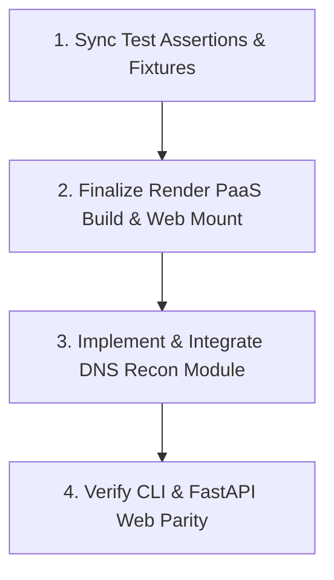

# 🛡️ Pentavault Security Suite — Comprehensive Rework & Deployment Brief

This document provides a complete technical synthesis of **Pentavault**'s project architecture, test status, data schemas, deployment configurations, and immediate rework roadmap.

---

## 1. Project Structure

Below is the directory layout of the Pentavault codebase:

```text
Pentavault/
├── scanner/
│   ├── main.py                     # CLI Entry Point
│   ├── web/
│   │   ├── app.py                  # FastAPI Backend & Telemetry Server
│   │   └── static/                 # Embedded React/HTML Web Dashboard
│   ├── core/
│   │   ├── crawler.py              # Async & Selenium Crawling Engine
│   │   ├── fingerprint.py          # WAF & Tech Stack Detection
│   │   ├── port_scanner.py         # Async Socket Port Scanner
│   │   ├── recon.py                # Subdomain, WHOIS & IP Discovery
│   │   └── scorer.py               # Risk Scoring & Severity Aggregator
│   ├── modules/                    # 23 Security Vulnerability Modules
│   │   ├── sqli.py                 # SQL Injection (Error, Time, Boolean)
│   │   ├── xss.py                  # Reflected & DOM Cross-Site Scripting
│   │   ├── headers.py              # Security Header Validation
│   │   ├── ssrf.py                 # Server-Side Request Forgery
│   │   ├── open_redirect.py        # Open Redirect Testing
│   │   ├── command_injection.py    # OS Command Injection
│   │   ├── lfi.py                  # Local File Inclusion
│   │   ├── xxe.py                  # XML External Entity
│   │   ├── ssti.py                 # Server-Side Template Injection
│   │   ├── nosqli.py               # NoSQL Injection
│   │   ├── cors_misconfig.py       # CORS Policy Checks
│   │   ├── crlf_injection.py       # CRLF Header Injection
│   │   ├── csv_formula_injection.py# CSV/Excel Formula Injection
│   │   ├── graphql_abuse.py        # GraphQL Introspection & Rate Limiting
│   │   ├── host_header.py          # Host Header Poisoning
│   │   ├── hpp.py                  # HTTP Parameter Pollution
│   │   ├── idor.py                 # Insecure Direct Object References
│   │   ├── insecure_deserialization.py
│   │   ├── jwt_checks.py           # JWT Vulnerability Scanner
│   │   ├── mass_assignment.py      # BOLA & Mass Assignment
│   │   ├── prototype_pollution.py  # JS Prototype Pollution
│   │   ├── request_smuggling.py    # HTTP Request Smuggling
│   │   └── sensitive_files.py      # Sensitive File & Endpoint Brute
│   ├── utils/
│   │   ├── ai_engine.py            # Gemini API Key Pool & Rate-Limit Rotator
│   │   ├── mitre_mapping.py        # MITRE ATT&CK Matrix & Kill-Chain Mapper
│   │   ├── pdf_report.py           # fpdf2 PDF & python-docx Report Generators
│   │   ├── report_exporter.py      # OWASP 2025 & JSON Summary Exporter
│   │   └── logger.py               # Telemetry & Terminal Logging
│   ├── data/
│   │   └── scan_history.json       # JSON Persistence Store
│   └── tests/                      # Pytest Suite (24 Test Files)
├── requirements.txt                # Python Dependencies
├── package.json                    # Node.js Utilities (docx)
├── pytest.ini                      # Test Runner Scope Configuration
├── context.md                      # Comprehensive Architecture Spec
└── README.md                       # Project Documentation
```

---

## 2. Test Suite & Cancellation Checkpoint Status

### Test Suite Execution Summary
Recent test refactoring resolved pytest collection failures (such as functions named `test_*` within module imports being misidentified as fixtures).

```bash
PYTHONPATH=. .venv/bin/pytest scanner/tests/test_cancellation_checkpoints.py -vv
```

**Output:**
```text
============================= test session starts ==============================
platform linux -- Python 3.11.15, pytest-9.1.1, pluggy-1.6.0
rootdir: /home/govind-v-kartha/Downloads/Pentavault
configfile: pytest.ini
collected 2 items                                                              

scanner/tests/test_cancellation_checkpoints.py::TestCancellationCheckpoints::test_crawler_honors_should_stop_before_fetch PASSED [ 50%]
scanner/tests/test_cancellation_checkpoints.py::TestCancellationCheckpoints::test_open_redirect_honors_should_stop_before_requests PASSED [100%]

============================== 2 passed in 0.06s ===============================
```

### Key Rework Fixes Applied
1. **Import Aliasing**: Aliased function imports in test files (e.g., `from scanner.modules.open_redirect import test_open_redirect as _run_open_redirect`) to prevent Pytest naming collisions.
2. **Cooperative Cancellation**: Added optional `should_stop: Callable[[], bool]` and `request_delay: float` parameters across crawler loop iterations and vulnerability testing loops.

---

## 3. Core Backend Entry Points

### A. FastAPI Web Application (`scanner/web/app.py`)
* **Framework:** FastAPI with Uvicorn.
* **Routes:**
  * `POST /api/scan`: Initiates background scan thread, returns `scan_id`.
  * `GET /api/scan/{scan_id}`: Real-time progress percentage, current stage, and findings stream.
  * `DELETE /api/scan/{scan_id}`: Triggers grace cancel callback via `should_stop`.
  * `GET /api/scans`: Historical scan list.
  * `GET /api/scan/{scan_id}/export/pdf`: Streaming PDF binary generated via `fpdf2`.
  * `GET /api/scan/{scan_id}/export/docx`: Streaming DOCX report generated via `python-docx`.
  * `GET /`: Serves static web UI dashboard (`scanner/web/static/index.html`).

### B. CLI Scanner Entry Point (`scanner/main.py`)
* **Execution:** `python -m scanner.main http://target.com --mode full --browser`
* **Features:** Terminal progress bars, ANSI colored output, direct JSON/PDF/DOCX export, and Gemini threat narrative generation.

---

## 4. Module Specifications & Interface Standard

All 23 vulnerability modules conform to a unified interface contract:

```python
def test_module_name(
    endpoints: list[str],
    forms: list[dict],
    headers: dict | None = None,
    cookies: dict | None = None,
    proxy: str | None = None,
    timeout: float = 10.0,
    quick: bool = False,
    should_stop: Callable[[], bool] | None = None,
    request_delay: float = 0.0,
) -> list[dict]:
    """Standard Pentavault Vulnerability Module Interface"""
```

### Standardized Finding Output Schema
```json
{
  "title": "Reflected XSS on /search",
  "severity": "Medium",
  "cvss_score": 6.1,
  "cvss_vector": "AV:N/AC:L/PR:N/UI:R/S:C/C:L/I:L/A:N",
  "affected_url": "http://example.com/search?q=test",
  "parameter": "q",
  "payload": "<script>alert(1)</script>",
  "evidence": "Reflected payload found in HTTP response body",
  "remediation": "Encode all user-supplied output contextually (HTML, JS, URL).",
  "owasp_category": "A05:2025 - Injection",
  "mitre_attack": [
    {
      "technique": "T1059.007",
      "name": "Command and Scripting Interpreter: JavaScript",
      "tactic": "Execution"
    }
  ]
}
```

---

## 5. Complete Test Suite Inventory

Located in `scanner/tests/`:
1. `test_ai_endpoints_cache.py`
2. `test_ai_engine_config_and_fallback.py`
3. `test_ai_engine_prompt_composition.py`
4. `test_ai_error_contract.py`
5. `test_browser_hardening.py`
6. `test_cancellation_checkpoints.py`
7. `test_command_injection_module.py`
8. `test_crawler_request_delay.py`
9. `test_csv_formula_injection_module.py`
10. `test_data_model_abuse_modules.py`
11. `test_dependency_check.py`
12. `test_false_positives.py`
13. `test_fingerprint_robustness.py`
14. `test_headers_quick_mode.py`
15. `test_hybrid_crawl.py`
16. `test_lfi_module.py`
17. `test_mitre_endpoint_cache.py`
18. `test_module_orchestration_new_modules.py`
19. `test_nosqli_module.py`
20. `test_payload_sets.py`
21. `test_protocol_abuse_modules.py`
22. `test_prototype_pollution_module.py`
23. `test_report_resilience.py`
24. `test_scan_elapsed_finalization.py`

---

## 6. Data Persistence Schema (`scanner/data/scan_history.json`)

```json
{
  "c39ac215-613d-4089-9a7d-4587cb74f53a": {
    "scan_id": "c39ac215-613d-4089-9a7d-4587cb74f53a",
    "status": "completed",
    "target": "http://127.0.0.1:9999",
    "url": "http://127.0.0.1:9999",
    "mode": "quick",
    "use_browser": false,
    "progress": 100,
    "current_stage": "Complete",
    "started_at": "2026-03-12T04:32:14",
    "completed_at": "2026-03-12T04:32:17",
    "elapsed": 3.0,
    "findings": [
      {
        "id": "F001",
        "title": "Open Redirect on /redirect",
        "severity": "Medium",
        "cvss_score": 4.7,
        "affected_url": "http://127.0.0.1:9999/redirect?url=http://example.com",
        "parameter": "url",
        "payload": "https://evil.com",
        "evidence": "Redirected to: https://evil.com",
        "owasp_category": "A01:2025 - Broken Access Control"
      }
    ],
    "summary": {
      "total_findings": 1,
      "risk_rating": "Medium",
      "critical": 0,
      "high": 0,
      "medium": 1,
      "low": 0
    },
    "recon_data": {
      "ip": "14.139.189.169",
      "dns_records": {
        "A": ["14.139.189.169"],
        "MX": ["10 ALT1.ASPMX.L.GOOGLE.COM."],
        "TXT": ["v=spf1 include:_spf.google.com ~all"]
      }
    }
  }
}
```

---

## 7. Deployment & Render Configuration

### `requirements.txt`
```text
httpx>=0.27.0
requests>=2.31.0
beautifulsoup4>=4.12.0
dnspython>=2.6.0
python-nmap>=0.7.1
scapy>=2.5.0
python-whois>=0.9.4
cvss>=3.1
selenium>=4.20.0
webdriver-manager>=4.0.0

# Web GUI
fastapi>=0.111.0
uvicorn[standard]>=0.29.0
python-dotenv>=1.0.1

# AI + Reports
google-generativeai>=0.8.0
fpdf2>=2.8.0
python-docx>=1.1.0
matplotlib>=3.9.0
```

### Render Blueprint Configuration (`render.yaml`)
```yaml
services:
  - type: web
    name: pentavault-vapt-suite
    env: python
    region: oregon
    plan: free
    buildCommand: "pip install -r requirements.txt"
    startCommand: "uvicorn scanner.web.app:app --host 0.0.0.0 --port $PORT"
    envVars:
      - key: PENTAVAULT_DATA_DIR
        value: "/tmp/pentavault_data"
      - key: PENTAVAULT_FRONTEND_MODE
        value: "react"
      - key: PENTAVAULT_GEMINI_MODELS
        value: "gemini-2.0-flash,gemini-2.0-flash-lite"
      - key: PENTAVAULT_GEMINI_API_KEYS
        sync: false
```

---

## 8. Environment Variables

| Variable Name | Purpose | Example / Default |
| :--- | :--- | :--- |
| `PENTAVAULT_GEMINI_API_KEYS` | Comma-separated Gemini API keys for round-robin rotation | `AIzaSyA...,AIzaSyB...` |
| `PENTAVAULT_GEMINI_MODELS` | Preferred Gemini models list | `gemini-2.0-flash,gemini-2.0-flash-lite` |
| `PENTAVAULT_DATA_DIR` | Path to persistent scan state directory | `scanner/data` or `/tmp/pentavault_data` |
| `PENTAVAULT_FRONTEND_MODE` | Determines dashboard routing | `react` |
| `PORT` | Bind port provided by Render PaaS | `10000` (Render default) |

---

## 9. DNS Reconnaissance Module Blueprint (`scanner/core/dns_recon.py`)

Below is the design specification for the upcoming **DNS Reconnaissance** feature:

```python
"""DNS Reconnaissance Module for Pentavault."""

from __future__ import annotations
import dns.resolver

def run_dns_recon(domain: str) -> dict[str, list[str]]:
    """Query A, AAAA, MX, TXT, NS, CNAME records using dnspython."""
    records: dict[str, list[str]] = {
        "A": [], "AAAA": [], "MX": [], "TXT": [], "NS": [], "CNAME": []
    }
    resolver = dns.resolver.Resolver()
    resolver.timeout = 3.0
    resolver.lifetime = 3.0

    for record_type in records.keys():
        try:
            answers = resolver.resolve(domain, record_type)
            records[record_type] = [str(r.to_text()) for r in answers]
        except Exception:
            pass

    return records
```

---

## 10. Prioritized Action Plan



1. **Priority A (Test Suite Stability):** Adjust assertion bounds in `test_payload_sets.py` to match updated payload dictionary sizes.
2. **Priority B (Render Cloud Deployment):** Validate static root route serving and verify bind address `0.0.0.0:$PORT`.
3. **Priority C (DNS Recon Module):** Finalize `scanner/core/dns_recon.py` and bind output into `recon_data` in scan reports.
4. **Priority D (CLI/Web Parity):** Confirm all 23 security modules are dynamically triggerable from both CLI (`scanner/main.py`) and FastAPI (`scanner/web/app.py`).
